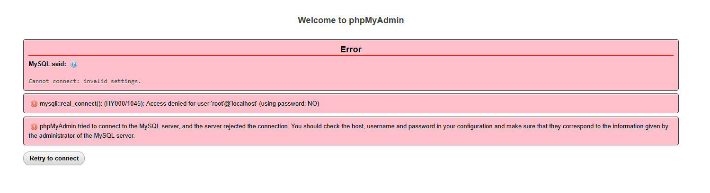
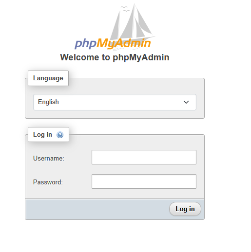

#  To enable the login form in phpMyAdmin, Show login screen, Set login enable for phpMyAdmin XAMPP 
```
https://www.youtube.com/watch?v=Wsrn1TSg_BU
```


Ah! You want **phpMyAdmin in XAMPP to show the login screen** so you can log in with a username and password instead of auto-login. Here’s the step-by-step way to enable it:

---

### 1️⃣ Open phpMyAdmin config

* Go to your XAMPP folder → `phpMyAdmin` → open `config.inc.php` in a text editor.
* Usually path:

```
C:\xampp\phpMyAdmin\config.inc.php
```

---

### 2️⃣ Find the authentication type line

Look for:

```php
$cfg['Servers'][$i]['auth_type'] = 'config';
```

* `config` = auto-login (uses username/password in config)
* `cookie` = asks for login in browser

---

### 3️⃣ Change to login screen

Change it to:

```php
$cfg['Servers'][$i]['auth_type'] = 'cookie';
```

* This enables the login screen when you access phpMyAdmin.

---

### 4️⃣ Optional: Remove stored username/password

* Comment out or remove these lines if present:

```php
$cfg['Servers'][$i]['user'] = 'root';
$cfg['Servers'][$i]['password'] = '';
```

* This ensures phpMyAdmin asks for the username/password instead of auto-using root.

---

### 5️⃣ Save the file and restart XAMPP

* Stop and start **Apache** and **MySQL** in XAMPP.
* Open phpMyAdmin in your browser (`http://localhost/phpmyadmin`)
* You should now see the **login screen**.

---

### 6️⃣ Log in

* Username: `root` (or any MySQL user you have)
* Password: `root` (or the password you set)
* If login fails, make sure the MySQL root user has a password set as explained earlier.

---

💡 **Tip:** Using `cookie` auth is safer because it won’t store passwords in a plain text file.

---

If you want, I can give you a **ready XAMPP config snippet** for `config.inc.php` that enables login and works even with MySQL 8+ passwords. It’s simpler than editing manually.

Do you want me to do that?


# Change MySQL Default Password
```
https://stackoverflow.com/questions/7534056/mysql-root-password-change
```

```
SET PASSWORD FOR 'root'@'localhost' = PASSWORD('mypass');
```

```
FLUSH PRIVILEGES;
```



